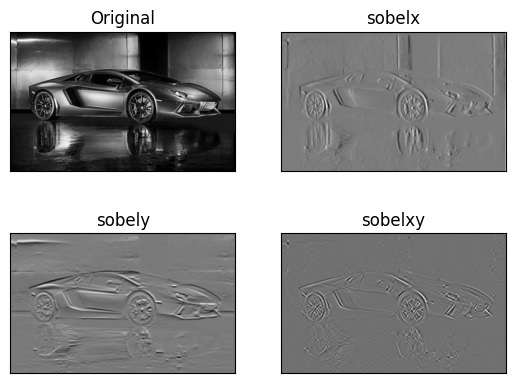
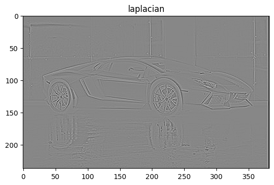
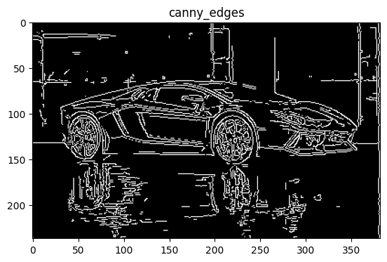

# Edge-Detection
## Aim:
To perform edge detection using Sobel, Laplacian, and Canny edge detectors.

## Software Required:
Anaconda - Python 3.7

## Algorithm:
### Step1:
Import all the necessary modules for the program.

### Step2:
Load a image using imread() from cv2 module.

### Step3:
Convert the image to grayscale

### Step4:
Using Sobel operator from cv2,detect the edges of the image.

### Step5:

Using Laplacian operator from cv2,detect the edges of the image and Using Canny operator from cv2,detect the edges of the image.
 
## Program:

``` Python
# Import the packages
# Reg no : 212222240047
# Name : Kavinraja D
import cv2
import numpy as np
import matplotlib.pyplot as plt

# Load the image, Convert to grayscale and remove noise
image1=cv2.imread ('car.jpg') 
gray = cv2.cvtColor(image1,cv2.COLOR_BGR2GRAY)
plt.title('GRAY IMAGE')
plt.imshow(gray,cmap = 'gray')

# SOBEL EDGE DETECTOR
img = cv2.GaussianBlur(gray,(3,3),0)
sobelx = cv2.Sobel(gray,cv2.CV_64F,1,0,ksize=5)
sobely = cv2.Sobel(gray,cv2.CV_64F,0,1,ksize=5)
sobelxy =cv2.Sobel(gray,cv2.CV_64F,1,1,ksize=5)
plt.figure(1)
plt.subplot(2,2,1)
plt.imshow(gray,cmap = 'gray')
plt.title('Original'), plt.xticks([]), plt.yticks([])

plt.subplot(2,2,2)
plt.imshow(sobelx,cmap='gray')
plt.title('sobelx')
plt.xticks([]), plt.yticks([])

plt.subplot(2,2,3)
plt.imshow(sobely,cmap='gray')
plt.title('sobely')
plt.xticks([]), plt.yticks([])

plt.subplot(2,2,4)
plt.imshow(sobelxy,cmap='gray')
plt.title('sobelxy')
plt.xticks([]), plt.yticks([])
plt.show()


# LAPLACIAN EDGE DETECTOR
laplacian = cv2.Laplacian(gray,cv2.CV_64F)
plt.imshow(laplacian,cmap='gray')
plt.title('laplacian')
plt.show()

# CANNY EDGE DETECTOR
canny_edges = cv2.Canny(gray, 110, 140)
plt.imshow(canny_edges,cmap='gray')
plt.title('canny_edges')
plt.show()


```
## Output:
### SOBEL EDGE DETECTOR



### LAPLACIAN EDGE DETECTOR



### CANNY EDGE DETECTOR


## Result:
Thus the edges are detected using Sobel, Laplacian, and Canny edge detectors.
